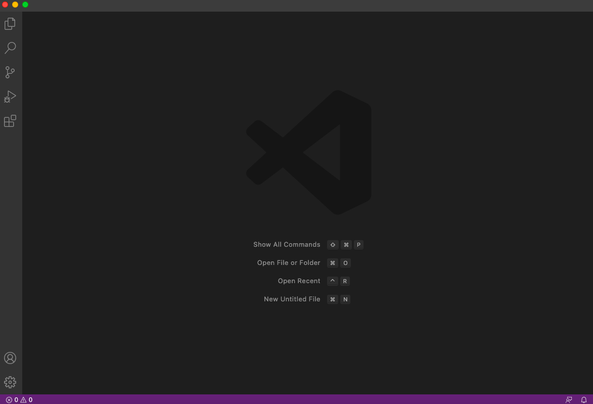
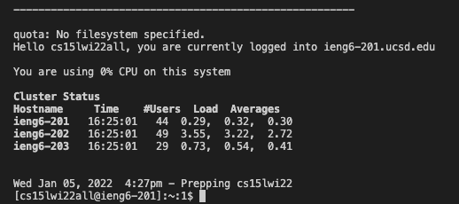
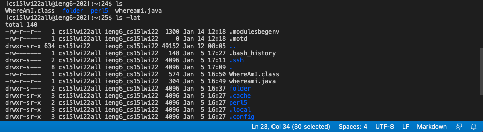
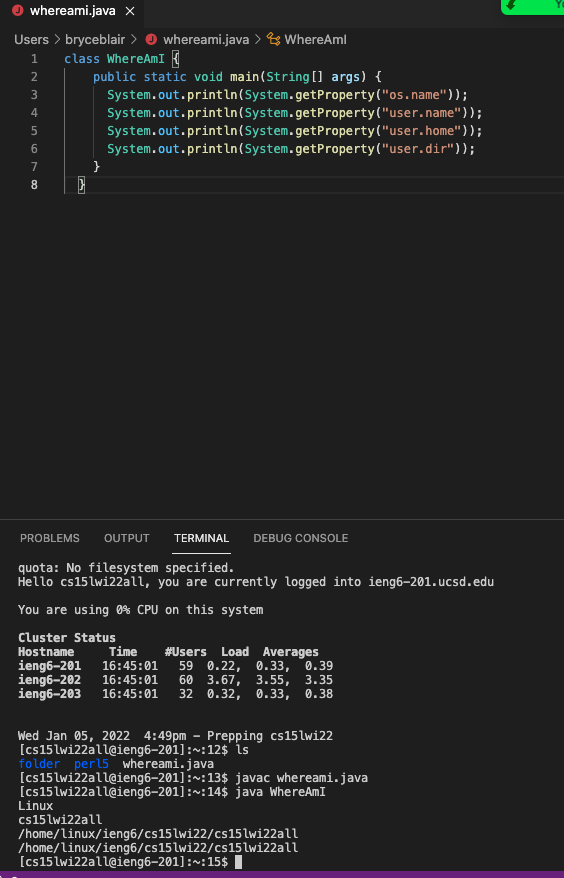
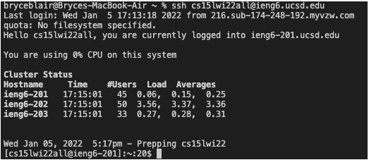
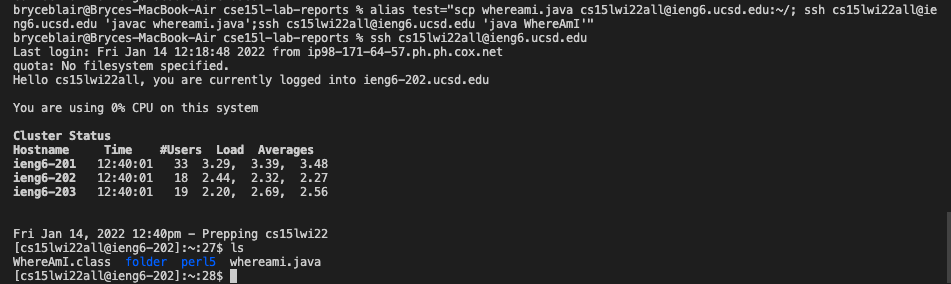

This is Bryce's lab report for week 2.

Today we are going to be teaching you how to log into your course specific account on `ieng6`.

Here are the 6 steps that we will be following.

1. Installing VS Code
2. Remotely coding
3. Trying some commands
4. Moving Files with `scp`
5. Setting an SSH key
6. Optimizing remote learning

**1. Installing VS Code**

Go to the Visual Studio Code website https://code.visualstudio.com/, and follow the instructions to download and install it on your computer. It should look like the following once installed.


**2. Remotely Coding**

First you need to obtain your course specific account for CSE15L. Then you are going to open a VSCode terminal and use the command 

```ssh cs15lwi22zz@ieng6.ucsd.edu```

You should use your student account instead of the one used above. Once you type this you will be prompted to enter your password. After entiring the correct passwork you will see a screen like the following that shows the 3 computers and the user counts on them. You are now logged into your account and are ready to remote code.



**3. Trying some commands**

Here are a list of commands you can try
- cd ~
- cd
- ls -lat
- ls -a
- du
- rm

Here is an example of what happens when you call ls and ls -lat 


**4. Moving files with `scp`**

First you are going to want to createa file on your computer called whereami.java and copy this code into it.
```
class WhereAmI {
  public static void main(String[] args) {
    System.out.println(System.getProperty("os.name"));
    System.out.println(System.getProperty("user.name"));
    System.out.println(System.getProperty("user.home"));
    System.out.println(System.getProperty("user.dir"));
  }
}
```
Run the code using javac and java. After doing this, run this command

```
scp whereami.java cs15lwi22zz@ieng6.ucsd.edu:~/
```

You will then again be asked for your password, once you input it the file will be copied over. Now lo gback into ssh sing the command from before and use ls. You should now see whereami.java in the computers files.



**5. Setting up an ssh key**

Using your password to log in back and forth everytime can get both annoying and time consuming. This problem can be solved by using ssh keys. In order to use this we are going to use the command `ssh-keygen`. So, on your client, type the command and then when asked for passphrase leave it empty by clicking enter. You have now created two files, a public and a private key. You are now going to copy the public key to the .ssh directory. After doing this you should be able to ssh and scp without needing to type a password as shown here.



**6. Optimizing remote learning**

Some tricks that you can use to make running even faster and more pleasent are the use of quotes and semicolons. 

Using semicolons allows for you to run muliple commands in one line.
Using quotes after an ssh command you can run it on the remote computer in one command. Some commands to try could include.

```
ssh cs15lwi22@ieng6.ucsd.edu "ls"

cp WhereAmI.java OtherMain.java; javac OtherMain.java; java WhereAmI
```

The following is one that I ran on my computer. This copies over whereami.java in one line of code, all you have to do is run the two lines.
```
 alias test="scp whereami.java cs15lwi22zz@ieng6.ucsd.edu:~/; ssh cs15lwi22zz@ieng6.ucsd.edu 'javac whereami.java';ssh cs15lwi22zz@ieng6.ucsd.edu 'java WhereAmI'"

 test
```
