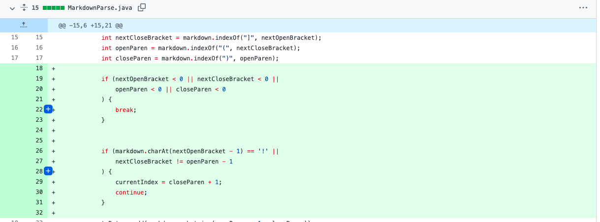
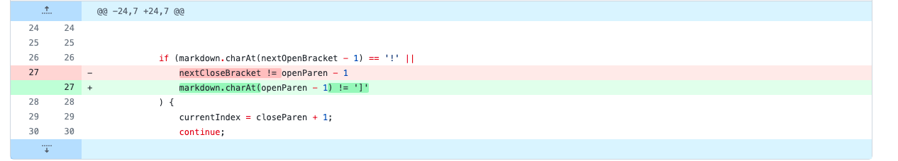
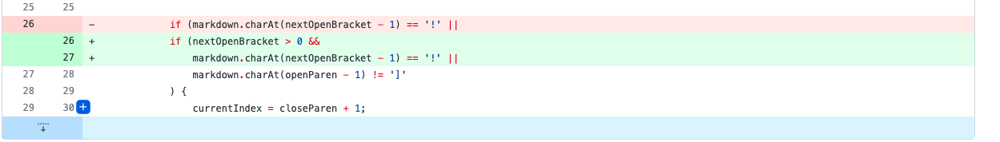

This is Bryce's 2nd Lab Report

**First Code Change:**

This is a screen shot of the first code change diff


[Failure inducing test#1](https://github.com/b1blair/markdown-parse/blob/6fbc3e6dc2ee161df95c5d6b31c30edd86a625cf/test-file-break.md?plain=1)

The following is the command followed by the symptom from what was printed at the terminal

Command
```
javac MarkdownParse.java
java MarkdownParse test-file-break.md
```

Symptom
```
Exception in thread "main" java.lang.OutOfMemoryError: Java heap space
        at java.base/java.util.Arrays.copyOf(Arrays.java:3512)
        at java.base/java.util.Arrays.copyOf(Arrays.java:3481)
        at java.base/java.util.ArrayList.grow(ArrayList.java:237)
        at java.base/java.util.ArrayList.grow(ArrayList.java:244)
        at java.base/java.util.ArrayList.add(ArrayList.java:454)
        at java.base/java.util.ArrayList.add(ArrayList.java:467)
        at MarkdownParse.getLinks(MarkdownParse.java:17)
        at MarkdownParse.main(MarkdownParse.java:27)
```

The failure inducing input was that the file was breaking because there were no brackets “[]” in the test case. This resulted in a symptom of producing an error message. This was a bug that we fixed by creating a case for in our code for it to not read until it discovers an open bracket.

**Second Code Change:**

This is a screen shot of the first code change diff


[Failure inducing test#2](https://github.com/b1blair/markdown-parse/blob/main/test-file-break.md?plain=1)

The following is the command followed by the symptom from what was printed at the terminal

Command
```
javac MarkdownParse.java
java MarkdownParse test-file-8.md
```

Symptom
```
[]
```

The failure inducing input was having a set of brackets in the link name such as [name[]]. This symptom was what resulted in now link being printed when the link should be printed in the list. The bug was that it was supposed to be printed bu was getting stopped early because it was reading another bracket instead of the starting parenthesis that it should be. We fixed this bug by changing an OR statement in the if statement. This resulted in a fix that would print the link.

**Third Code Change:**

This is a screen shot of the first code change diff


[Failure inducing test#3](https://github.com/b1blair/markdown-parse/blob/main/test-file8.md?plain=1)

The following is the command followed by the symptom from what was printed at the terminal

Command
```

```

Symptom
```
Exception in thread "main" java.lang.StringIndexOutOfBoundsException: String index out of range: -1
        at java.base/java.lang.StringLatin1.charAt(StringLatin1.java:48)
        at java.base/java.lang.String.charAt(String.java:1512)
        at MarkdownParse.getLinks(MarkdownParse.java:24)
        at MarkdownParse.main(MarkdownParse.java:40)
```

The failure inducing input was having the link on the first line with a set of empty brackets. This symptom was what resulted in an error message revealing an unaccounted for bug of having the next open bracket at greater than 0. In order to fix this bug we had to add into the if statement a statement that said the next open bracket had to be greater than 0. By adding this statement it should now correctly print out with the link followed by the empty parenthesis.
