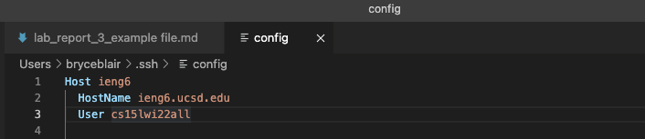
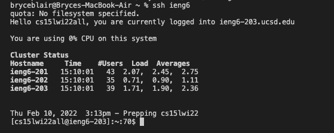
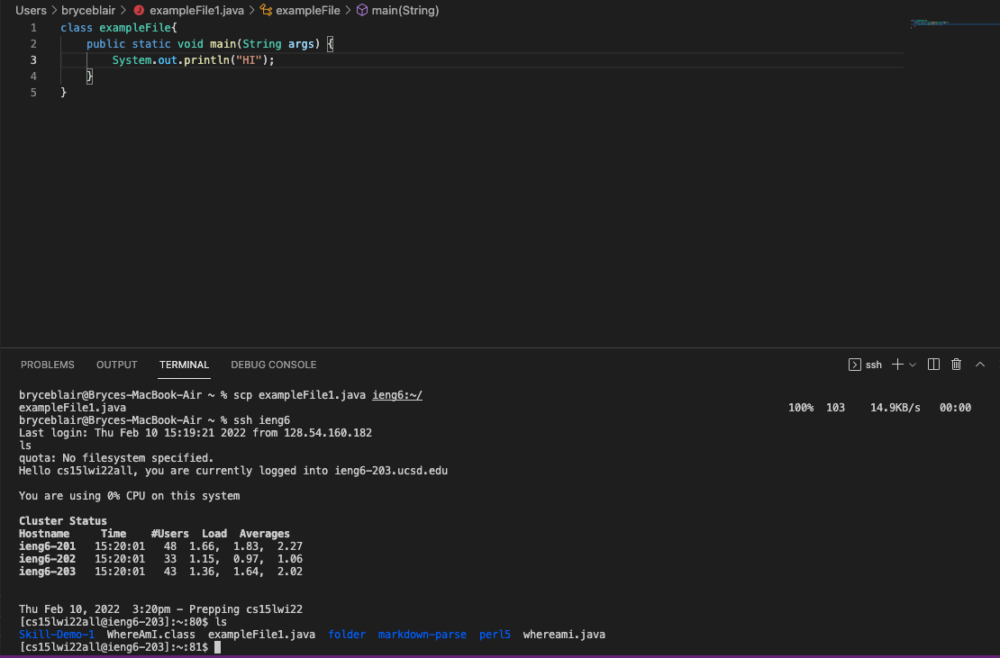

This is Bryce's Third Lab Report

In this lab report I will demonstrate how to streamline your ssh configuration, as well as how to use this streamline while running commands.

The first step is to open your `.ssh/config` file in an environment where you can edit the file. If you do not have th file, you should create it. After opening your file you should copy this command into your file and save it.

```
Host ieng6
    HostName ieng6.ucsd.edu
    User cs15lwi22zzz (use your username)
```
The file should look like this after being edited. 



After doing this try to run the command
```
ssh ieng6
```
If everything is set up correctly then it should ssh you into the remote server. If it does not work you may need to add an additional line of code. Try using the following code.
```
Host ieng6
    HostName ieng6.ucsd.edu
    User cs15lwi22zzz (use your username)
    IdentityFile ~/.ssh/id_rsa_ucsd
```
Logging into the remote server with your new stream line should look like this.



Now that we have set up the streamline and verifired that it works, we can now use it to run commands. Here is an example of me using the streamline to scp an example file into the remote account. I also show the ls in the remote account to show the file was copied over.



This is the end of lab report 3. Thank You!