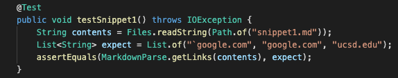
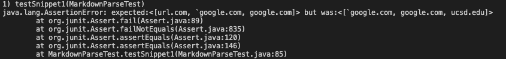
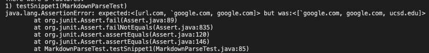
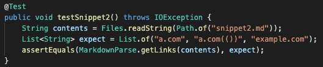
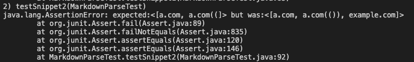
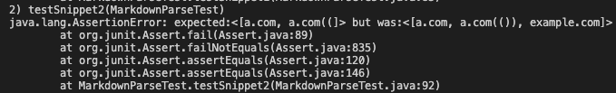
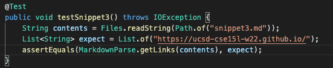
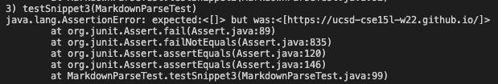
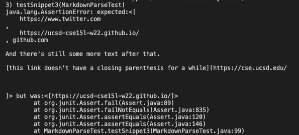

This is Bryce's Fourth Lab Report

In this lab report I will be testing both my implementation of MarkdownParse.java as well as another groups implementation with 3 tests for each.

Here is the link to my MarkdownParse repo.
[Mine](https://github.com/b1blair/markdown-parse)

Here is the link to the other groups MarkdownParse repo.
[Other Group](https://github.com/annakkin/markdown-parse)

The first test that will be tested on each MarkdownParse will be 
## Snippet 1
```
`[a link`](url.com)

[another link](`google.com)`

[`cod[e`](google.com)

[`code]`](ucsd.edu)
```
The expected output for Snippet 1 for both MarkdownParse files is:
```
[`google.com, google.com, ucsd.edu]
```
The following is the JUnit test for snippet 1 that I ran for both my MarkdownParse and the other MarkdownParse. (It was run once on both)


Output for my implementation:



Output for other implementation:



---
The second test that I tested on both MarkdownParse's was
## Snippet 2
```
[a [nested link](a.com)](b.com)

[a nested parenthesized url](a.com(()))

[some escaped \[ brackets \]](example.com)
```
The expected output for Snippet 2 for both MarkdownParse files is:
```
[a.com, a.com(()), example.com]
```
The following is the JUnit test for snippet 2 that I ran for both my MarkdownParse and the other MarkdownParse. (It was run once on both)


Output for my implementation:



Output for other implementation:



---
The third test that I tested on both MarkdownParse's was
## Snippet 3
```
[this title text is really long and takes up more than 
one line

and has some line breaks](
    https://www.twitter.com
)

[this title text is really long and takes up more than 
one line](
    https://ucsd-cse15l-w22.github.io/
)


[this link doesn't have a closing parenthesis](github.com

And there's still some more text after that.

[this link doesn't have a closing parenthesis for a while](https://cse.ucsd.edu/


)

And then there's more text
```
The expected output for Snippet 3 for both MarkdownParse files is:
```
[https://ucsd-cse15l-w22.github.io/]
```
The following is the JUnit test for snippet 3 that I ran for both my MarkdownParse and the other MarkdownParse. (It was run once on both)


Output for my implementation:



Output for other implementation:



# End of Lab questions

1. I think that for Snippet 3 cases and related cases with inline code with backticks would probably require a change of more than 10 lines. We would need to create a tracker for the back ticks and make it so that our code does not read the brackets or parens when a backtick hasn't been closed off. This would result in a large code change.
2. I think that for Snippet 2 cases and related cases with nested parens and backets, it would require a change of more than 10 lines. To fix this probelm you would need to either add a counter for brackets and parenthesis or a stack to keep track of it. I believe these would be a code change that is larger than 10 lines.
3. I think that for Snippet 3 cases and related cases with new lines in brackets and parenthesis would only require a small code change for my code. It would most likely be something added to an if statement checking for a '\n'.