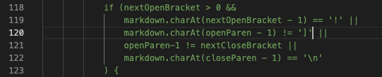
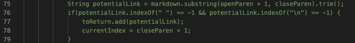

This is Bryce's 5th Lab Report

In this lab report I will be comparing my / my lab groups implementation of markdown parse differs from the implementation provided in lab 9. The two tests that I ran had different answers for both implementations. 

For both of my tests my lab group used `diff` on the results of running the bash for loop.

---
## Test 1
The first test file that I chose with different results was file "201.md"
This file contains the following code
```
[foo]: (baz)

[foo]
```
The expected output is `[(baz)]`

My implementation's output is `[]`

The other implementation's output is `[baz]`

With these outputs, we can see that neither implementation is correct with this method.

In the my implementations code we can see that it will automatically assume that it is not possible for it to be a link if there is a space after the last close bracket. We also need a to add another way of finding links because this test shows that there is another way of making links. We would need to add a check for ":" after the last close paren. Then if we find the colon after a close paren, if the same name inside of brackets occurs in the file we must add the link to the arraylist, even without parenthesis after it. This is one way that links are made in markdown that we do not check for at all in either file.

This is the code (line 120) that would need changing in regards to ending after not finding a open paren after a close bracket, however, we would also have to add more to check for the ":" after the close bracket check.



---
## Test 2

```
[a](url "tit")
```

The expected output is `[url]`

My implementation's output is `[url "tit"]`

The other implementation's output is `[]`

With these outputs we can see that neither implementation is correct. 

In the other implementations code we can see that it produces the wrong output because it checks after the trim to see if there si still a space in the url even after a trim. In this case markdown still creates the link even with the space because the "tit" counts as a title not the link. In order to fix this, we need to update the check for no spaces to include a check for a space with a quote. The added check would look something like `" &quot;"`.

The code that would need to change would be the check shows here on line 76.
